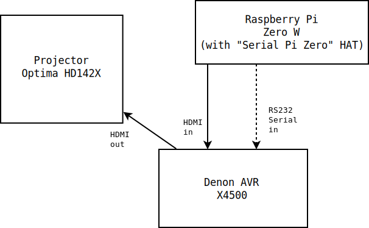

# fix-cec-serial

Get a Denon AVR to automatically power on/off an Optima projector

## Introduction

I found that when I powered on my Denon AVR (X4500) the Optima (HD142X)
projector that it was connected to would not automatically switch on. This
*should* work.  But the HDMI protocol involved (called "CEC") is often
not reliable, especially when combining products from different brands
(Denon and Optima in this case).

## Overview of solution

I connected a Raspberry Pi to one of the Denon AVR's HDMI inputs.
I added an RS232 serial port to the Raspberry Pi so that the Raspberry
Pi could connect to the Denon AVR's RS232 serial input.

 

Running the code (main.cc) on the Raspberry Pi means that the Pi will
notice when the Denon AVR is switched on and it will then switch on the
Optima projector (via its HDMI cable). Similarly, when the Denon AVR is
switched off, the Pi will notice and switch off the Optima projector.

Note: I found using the RS232 serial port more reliable than a wifi
based connection.

## Setting up the Denon AVR

You will need to configure some settings on the Denon AVR.

### Set up CEC

In Video/HDMI Setup I have set:

* HDMI Control = On
* Power Off Control = All
* RC Source Select = Power On + Source

## Setting up the Raspberry Pi

I used a Raspberry Pi Zero W. I connected it to one of the space
HDMI inputs on the back of the AVR.  I installed Raspbian 10 on it.
I added a physical serial port to the Pi. I chose a "Serial Pi Zero"
HAT from https://www.abelectronics.co.uk. This serial port shows up
as `/dev/ttyAMA0`. I connected the "Serial Pi Zero" serial port
to the Denon AVR's RS232 port using a standard (ie not null modem)
serial cable.

### Install software on Pi

You need to have a C++ Complier installed

```
sudo apt install g++
```

Also, the make utility

```
sudo apt install make
```

install git

```
sudo apt install git
```

and also some libraries related to HDMI/CEC

```
sudo apt install libraspberrypi-dev libraspberrypi0
sudo apt install cec-utils libcec4
```

### Configure /boot/config.txt

Add the following setting to the file `/boot/config.txt`

```
hdmi_ignore_cec_init=1
```

and reboot.

# Download `fix-cec-serial`

```
git clone https://github.com/stuart-mclaren/fix-cec-serial
```
## Building `fix-cec-serial`

### Edit main.cc to set the serial device

By default `main.cc` uses serial device `/dev/ttyAMA0`.

If you are using a "Serial Pi Zero" or something else that uses the
Pi's local serial port (`/dev/ttyAMA0`) you will not need to edit
`main.cc`.

However, if you are using different serial port hardware then you
will need to edit the file `main.cc` to enter the serial port device.

Change this line:

```
#define SERIAL_PORT "/dev/ttyAMA0"
```

to match your serial port device, for example

```
#define SERIAL_PORT "/dev/ttyS0"
```

### Compiling `fix-cec-serial`

To compile the code, run the following (from inside the `fix-cec-serial`
directory):

```
make
```

This will create the file `fix-cec-serial`.

### Installing `fix-cec-serial`

```
sudo make install
```

This will copy the binary to `/usr/local/bin/fix-cec-serial` and
configure a systemd service called `fix-cec-serial` to run the
binary automatically when the Pi boots.

You can check the service is correctly starting on boot by rebooting
the Pi


```
sudo reboot
```

and then, once the Pi has booted, running:

```
systemctl status fix-cec-serial
```

If it's working, the output should show:

```
● fix-cec-serial.service - fix-cec-serial service
   Loaded: loaded (/etc/systemd/system/fix-cec-serial.service; enabled; vendor preset: enabled)
   Active: active (running) since Thu 2022-03-17 19:15:01 GMT; 8s ago
 Main PID: 1296 (fix-cec-serial)
    Tasks: 5 (limit: 421)
   CGroup: /system.slice/fix-cec-serial.service
           └─1296 /usr/local/bin/fix-cec-serial

```
# A note on logging

The code logs *a lot*. You will need to make sure that logs, eg
in /var/log are rotated to avoid filling up the filesystem.

Alternatively, remove the various `printf` statements from `main.cc`.

The various DP messages are output from the AVR.  The DPX messages are debug.

# Can I avoid the projector turning on in some cases?

In some cases, eg when using a turntable or the tuner, you may not want
the projector to switch on when you turn on the AVR.

See the following note in the code for how to change this behaviour:

```
Note: For non-video sources
```

Basically add `100` to the source that you don't want to power on the
projector for. Eg to prevent the projector turning on when playing vinyl
records change this line:

```
phono = 9,
```
to this

```
phono = 109,
```

This assumes that you have the following set on the AVR

```
RC Source Select = Power On + Source
```

and you power on the AVR by pressing the `Phono` button
on the AVR's remote control.

# Acknowledgments

The code is based on https://github.com/glywood/cec-fix
